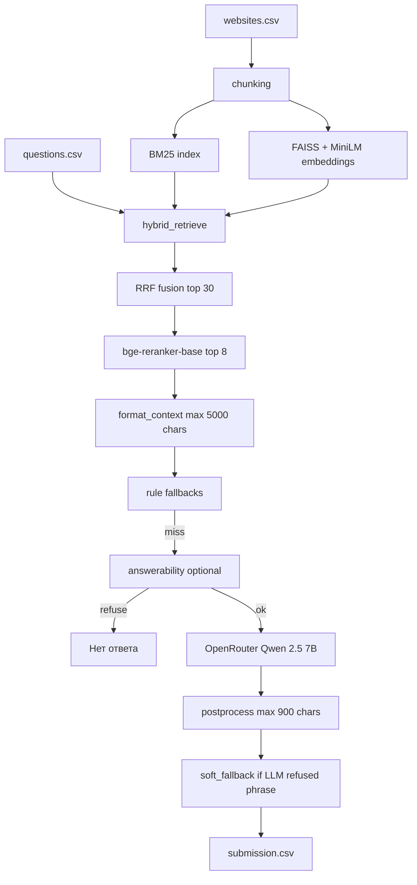

# RAG — Альфа-Банк × МФТИ (база знаний alfabank.ru)

Проект хакатона: по вопросу из `questions.csv` найти фрагменты в корпусе `websites.csv` и сгенерировать ответ в `submission.csv` (`q_id`, `answer_new`).

**Результат на платформе: 52 балла** (финальный сабмит — `submission.csv`, бэкап `archive/submissions/submission.csv.bak.FULL`).

Документ для **следующего агента/разработчика**: что сделано, как устроено, как воспроизвести и куда копать дальше.

---

## Содержание

1. [Метрики оценки](#метрики-оценки)
2. [Итоговый результат и статистика сабмита](#итоговый-результат-и-статистика-сабмита)
3. [Архитектура пайплайна](#архитектура-пайплайна)
4. [Ключевые решения (что дало скор)](#ключевые-решения-что-дало-скор)
5. [Структура репозитория](#структура-репозитория)
6. [Окружение и запуск](#окружение-и-запуск)
7. [Генерация submission](#генерация-submission)
8. [Локальная оценка Recall-L](#локальная-оценка-recall-l)
9. [Конфигурация (.env)](#конфигурация-env)
10. [Известные проблемы и грабли](#известные-проблемы-и-грабли)
11. [Идеи для улучшения](#идеи-для-улучшения)

---

## Метрики оценки

### Официальная метрика платформы: **Recall-L** (не ROC-AUC)

Источник: `competition_rag.pdf` / `competition_rag.txt`, приложение «Метрика BERT-RECALL».

Для каждого вопроса `q`:

```
Recall-L(q) = R_BERT(q) × L(q)

Recall-L = (1 / |Q|) × Σ_q Recall-L(q)
```

| Компонента | Смысл |
|------------|--------|
| **R_BERT(q)** | **Recall** метрики **BERTScore** между ответом участника `a_q` и эталоном `g_q` (семантическое покрытие эталона, не точное совпадение слов). |
| **L(q)** | Множитель длины по токенам эталона `l_r` и ответа `l_a`. |

**Штраф длины L(q)** (по токенам):

| Условие | L(q) |
|---------|------|
| `l_a ≤ 1.5 × l_r` | 1.0 |
| `1.5 × l_r < l_a < 3 × l_r` | линейный спад от 1 до 0 |
| `l_a ≥ 3 × l_r` | 0.0 |

**Интерпретация:** высокий Recall-L нужны и **смысл близкий к эталону**, и **длина не раздута** (иначе L→0).

**Отказ** в ответе — строка **`Нет ответа`** (регистр при сравнении в локальном eval — lower case `нет ответа`).

### Локальная разработка: `sample_submission.csv`

Файл с **6977 эталонными ответами** (те же `q_id`, что в `questions.csv`). Используется **только offline**:

- `scripts/eval_recall_l.py` — прокси метрики организаторов;
- `scripts/train_answerability.py` — обучение классификатора отказа (опционально).

**Не копировать** `sample_submission.csv` в сабмит без прохождения RAG-пайплайна (риск на code review).

### Реализация метрики в коде

- [`src/metrics/recall_l.py`](src/metrics/recall_l.py) — `length_multiplier`, `recall_l_corpus`, отчёт `RecallLReport` (false refuse / false answer).
- [`scripts/eval_recall_l.py`](scripts/eval_recall_l.py) — CLI, tokenizer `bert-base-multilingual-cased`, bert-score `lang=ru`.

```powershell
.\.venv\Scripts\python.exe scripts\eval_recall_l.py --pred submission.csv --gold sample_submission.csv
.\.venv\Scripts\python.exe scripts\eval_recall_l.py --pred submission.csv --gold sample_submission.csv --limit 500
```

### Ограничения платформы

- Загрузка CSV: **не более 3 раз в сутки** (00:00–23:59 МСК).
- Топ-10 — **code review** (нужен воспроизводимый код, не «заливка эталона»).

---

## Итоговый результат и статистика сабмита

| Показатель | Значение |
|------------|----------|
| Балл на платформе | **52** |
| Строк в `submission.csv` | **6977** |
| «Нет ответа» в финале | **0** (~0%) |
| Медиана длины ответа | **~227** символов |
| Эталон (`sample_submission.csv`) | ~**21%** отказов, медиана длины ~**262** симв. |

**Контраст с ранним сабмитом** (до переработки под Recall-L): ~**70%** отказов, медиана ~10 символов — массовые **false refuse** (~3580 пар «в эталоне есть ответ, у нас отказ»), R_BERT ≈ 0.

Финальная стратегия: **агрессивно отвечать** при непустом контексте (не отказывать по `low_confidence`), короткие ответы 1–4 предложения, postprocess без markdown/префиксов.

---

## Архитектура пайплайна



### Этапы по модулям

| Этап | Модуль | Детали |
|------|--------|--------|
| Чанкинг | `src/chunking.py`, `scripts/build_index.py` | `CHUNK_SIZE=1000`, overlap 100 |
| Dense | `src/embeddings.py`, `src/index_store.py` | fastembed `paraphrase-multilingual-MiniLM-L12-v2`, FAISS |
| Sparse | `src/bm25.py` | BM25Okapi |
| Fusion | `src/retrieval.py` | RRF `k=60`, top 30 → rerank top 8 |
| Rerank | `src/reranker.py` | `BAAI/bge-reranker-base` (ONNX, `RERANKER_ENABLED`) |
| Фильтр | `src/retrieval.py` | `KEYWORD_MIN_OVERLAP=1` по значимым токенам |
| Генерация | `src/llm.py`, `src/prompts.py` | OpenAI-compatible API |
| Постобработка | `src/postprocess.py` | cap 900, без `**`, без «Согласно фрагменту…» |
| Fallback | `src/fallbacks.py` | regex-правила (БИК, кэшбэк…), extractive/soft ~260 симв. |
| Оркестрация | `src/pipeline.py` | `RAGPipeline`, `compose_answer` |

**Важно:** `low_confidence` (низкий RRF) **не блокирует** ответ — только пустой контекст и (если включено) `answerability`.

---

## Ключевые решения (что дало скор)

### 1. Смена цели с «минимум отказов» на Recall-L

- Метрика штрафует **false refuse** (эталон с ответом, мы — «Нет ответа») сильнее, чем лишний короткий ответ.
- Убран ранний отказ по `low_confidence` в пользу LLM при любом непустом контексте.

### 2. Длина ответа под L(q)

- `LLM_MAX_TOKENS=280`, промпт «1–4 предложения, без markdown».
- `MAX_ANSWER_CHARS=900`, `SOFT_FALLBACK_MAX_LEN=260` (~медиана gold).
- `soft_fallback`: если LLM написал отказную фразу, но есть чанк — extractive обрезка по предложению **без** префикса «Согласно Фрагменту 1».

### 3. LLM: OpenRouter + Qwen 2.5 7B

В финальном прогоне (осознанное отступление от PDF «только локальный inference»):

```ini
LLM_PROVIDER=openrouter
OPENROUTER_MODEL=qwen/qwen-2.5-7b-instruct
LLM_CONCURRENCY=6
LLM_MAX_TOKENS=280
```

Альтернативы в коде: YandexGPT, GigaChat (`src/llm.py`).

### 4. Retrieval: hybrid + rerank

- BM25 + dense (MiniLM) + RRF стабильнее одного канала на русском корпусе банка.
- Cross-encoder rerank заметно улучшает top-8 для промпта.

### 5. Answerability (опционально, в финале выключено)

- `src/answerability.py` + `scripts/train_answerability.py` — LogisticRegression по фичам retrieval, обучение на `sample_submission.csv`.
- В финале: `ANSWERABILITY_ENABLED=false` (модель `artifacts/answerability.pkl` не обязательна).
- Целевой уровень отказов в gold ~20%; наш финал — **0%** отказов (компромисс: меньше false refuse, риск false answer).

### 6. Надёжная генерация 6977 вопросов

- **Sync** `--workers 2` (меньше RAM, чем 4–6 — меньше WerFault на Windows).
- Чекпоинт каждые **100** ответов в `submission.csv`.
- Продолжение: `--continue-from submission.csv` (догоняет только недостающие `q_id`, мержит с уже готовыми).

**Не использовать** `--async` без доработки: retrieval в `run_async` идёт **последовательно** (~40 с/вопрос).

---

## Структура репозитория

```
RAG/
├── submission.csv             # активный сабмит для платформы
├── questions.csv, websites.csv, sample_submission.csv
├── AGENTS.md                  # указатель → agent/AGENTS.md
├── STATE.md                   # копия agent/STATE.md (авто)
├── src/, scripts/, tests/     # код проекта
├── data/, artifacts/          # кэш и индекс
├── agent/                     # планы, journal, AGENTS, STATE (источник)
│   ├── plan/, specs/, cursor/rules/
│   └── LAYOUT.md
├── archive/
│   ├── submissions/           # submission.csv.bak.* и черновики
│   └── logs/                  # *.log прогонов
├── materials/                 # competition_rag.*, PDF, PNG
└── .env, requirements.txt
```

Подробнее: `agent/LAYOUT.md`.

---

## Окружение и запуск

**ОС:** Windows, PowerShell. **Python:** 3.11, venv в `.venv`.

```powershell
cd C:\ai_slop\ALPHA\RAG
py -3.11 -m venv .venv
.\.venv\Scripts\Activate.ps1
pip install -r requirements.txt
copy .env.example .env
# Заполнить OPENROUTER_API_KEY (или Yandex / GigaChat)
```

### Индекс (один раз или при смене корпуса / модели эмбеддингов)

```powershell
.\.venv\Scripts\python.exe scripts\build_index.py
# при нехватке RAM: закрыть лишние приложения; в build_index уже OMP_NUM_THREADS=1
```

Проверка импорта после правок (обязательно — см. грабли):

```powershell
.\.venv\Scripts\python.exe -c "from src.llm import normalize_answer; print(normalize_answer('тест'))"
```

---

## Генерация submission

### Полный прогон с нуля

```powershell
.\.venv\Scripts\python.exe scripts\generate_submission.py --refresh --workers 2 --output submission.csv
```

- `--refresh` — без кэша `answers.db`, все вопросы заново.
- Оценка времени: **~15–25 ч** на 6977 при `--workers 2` (CPU: embed + rerank + LLM).

### Продолжение после остановки

```powershell
Copy-Item submission.csv archive/submissions/submission.csv.bak.partial -Force
.\.venv\Scripts\python.exe scripts\generate_submission.py --continue-from submission.csv --workers 2 --output submission.csv
```

**Без** `--refresh`. Скрипт пропускает `q_id`, уже есть в CSV, и дописывает остальные; чекпоинты пишут **полный** merged файл.

### Async (не рекомендуется на полном корпусе без патча)

```powershell
.\.venv\Scripts\python.exe scripts\generate_submission.py --async --refresh
```

LLM батчится, но retrieval последовательный — очень долго.

### Валидация перед загрузкой

```powershell
.\.venv\Scripts\python.exe scripts\validate_submission.py --file submission.csv
```

### Перегенерация только отказов

```powershell
.\.venv\Scripts\python.exe scripts/regenerate_no_answer.py --checkpoint-every 50
```

---

## Локальная оценка Recall-L

```powershell
.\.venv\Scripts\python.exe scripts\eval_recall_l.py --pred submission.csv --gold sample_submission.csv
```

Пример вывода (субсет 200, старый сабмит с 42% отказов): Recall-L ≈ **0.56**, false refuse **76**.

Полный корпус — долго (BERTScore батчами). Для smoke: `--limit 200`.

Потолок sanity-check:

```powershell
.\.venv\Scripts\python.exe scripts\eval_recall_l.py --pred sample_submission.csv --gold sample_submission.csv --limit 100
```

---

## Конфигурация (.env)

Рекомендуемые значения для **воспроизведения финала** (см. также [`.env.example`](.env.example)):

| Переменная | Финальное значение | Назначение |
|------------|-------------------|------------|
| `LLM_PROVIDER` | `openrouter` | Провайдер LLM |
| `OPENROUTER_MODEL` | `qwen/qwen-2.5-7b-instruct` | Генерация |
| `LLM_MAX_TOKENS` | `280` | Не раздувать ответ (L(q)) |
| `LLM_TEMPERATURE` | `0.15` | |
| `LLM_CONCURRENCY` | `6` | async / семафор |
| `FASTEMBED_MODEL` | `paraphrase-multilingual-MiniLM-L12-v2` | Dense |
| `FASTEMBED_RERANK_MODEL` | `BAAI/bge-reranker-base` | Rerank |
| `TOP_K_RETRIEVE` | `30` | |
| `TOP_K_FINAL` | `8` | В промпт |
| `MIN_RRF_SCORE` | `0.003` | Не использовать как жёсткий отказ |
| `MAX_CONTEXT_CHARS` | `5000` | |
| `MAX_ANSWER_CHARS` | `900` | postprocess |
| `SOFT_FALLBACK_MAX_LEN` | `260` | |
| `RERANKER_ENABLED` | `true` | |
| `ANSWERABILITY_ENABLED` | `false` | Финальный сабмит |

Обучение answerability (опционально):

```powershell
.\.venv\Scripts\python.exe scripts\train_answerability.py --limit 1200
# затем ANSWERABILITY_ENABLED=true, ANSWERABILITY_THRESHOLD=0.55
```

---

## Известные проблемы и грабли

### 1. Битый `src/postprocess.py` (UTF-16 / mojibake)

Симптом: `SyntaxError: invalid character` при `from src.llm import normalize_answer`, WerFault при генерации.

**Фикс:** файл должен быть **UTF-8**, начинаться с нормального `"""Clean and normalize..."""`. После правок — проверка командой импорта выше.

### 2. Падение / OOM на Windows

- Не запускать **несколько** `generate_submission` параллельно.
- `--workers 2`, не 6, если мало RAM (каждый воркер тянет embed + rerank).
- Не использовать `Tee-Object` в тот же лог, что читает другой процесс.

### 3. `--refresh` vs `--continue-from`

| Флаг | Поведение |
|------|-----------|
| `--refresh` | Игнорировать кэш, обработать все вопросы (перезапись логики с нуля) |
| `--continue-from X.csv` | Пропустить готовые `q_id` из X, мерж в `--output` |

### 4. `Read` / grep по всему проекту

На больших `.hf_cache` / venv возможны таймауты — искать в `src/`, `scripts/` точечно.

### 5. PDF

Условие: `competition_rag.pdf` — для формул рендер через `C:\Users\runka\.agents\scripts\pdf_reader.py`, текст в `competition_rag.txt`.

---

## Идеи для улучшения

Приоритет по Recall-L (локально проверять `eval_recall_l.py`):

1. **Калибровка отказов ~15–25%** — включить `answerability` или промпт «Нет ответа» ближе к gold; сейчас 0% отказов → риск false answer и длинных галлюцинаций.
2. **Эмбеддинги** — e5 / mpnet (нужна пересборка индекса, риск OOM на 16 GB RAM).
3. **LLM** — `qwen/qwen-2.5-14b-instruct` на subset 500, сравнить Recall-L и долю отказов.
4. **Параллельный retrieval в `--async`** — ThreadPoolExecutor, иначе полный прогон непрактичен.
5. **`MIN_RRF_SCORE=0`**, `TOP_K_RETRIEVE=40` — если растёт false refuse при пустом overlap.
6. **Локальный Qwen через Ollama** — запасной путь для code review (PDF требует local inference).

---

## Краткая хронология (для агента)

| Этап | Состояние |
|------|-----------|
| Ранняя версия | ~70% «Нет ответа», низкий Recall-L |
| Метрика + postprocess + prompts | Цель Recall-L, длина ~260 симв. |
| Прогон | sync `--workers 2`, чекпоинты, `--continue-from` после 3400 |
| Финал | 6977 строк, 52 балла, `archive/submissions/submission.csv.bak.FULL` |

**Следующий шаг агента:** прогнать `eval_recall_l.py` на `archive/submissions/submission.csv.bak.FULL`, сравнить с gold, точечно подкрутить отказы/длину/модель, не ломая `postprocess.py` кодировку.

---

## Ссылки

- Условие: [`competition_rag.txt`](competition_rag.txt)
- План доработок (не редактировать автоматически): `.cursor/plans/recall-l-finish.plan.md`
- Workspace rules: `C:\ai_slop\AGENTS.md`, `C:\ai_slop\.cursor\rules\workspace-core.mdc`
